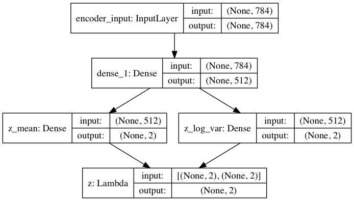
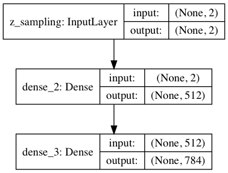
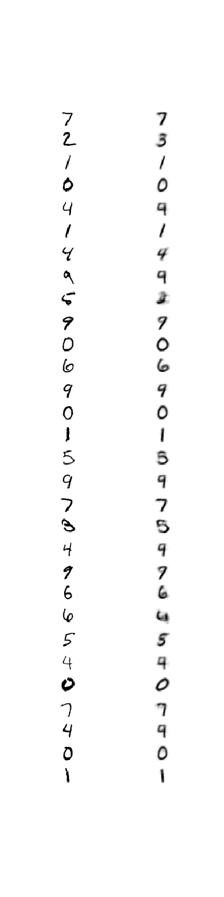

## VAE in Keras
Variational Autoencoder model in Keras.

#### Model Architecture:
Input(784) --> Dense(512) --> 2*Dense(2) --> z_mean(2), z_var(2) --> Latent(2) by Reparameterization Trick
Latent(2) -->  Dense(512) --> Dense(784)

Encoder Model Architecture:

Decoder Model Architecture:

## Tensorboard
Tensorboard can be run using `tensorflow.python.keras.callbacks.TensorBoard` API.

### Reparameterization
Reparameterization Trick is a crucial part of VAE as mentioned in Kingma's paper [Auto-Encoding Variational Bayes](https://arxiv.org/pdf/1312.6114.pdf).

Nice visual of how reparameterization helps in calculating gradient of a stochastic objective function:
<http://nbviewer.jupyter.org/github/gokererdogan/Notebooks/blob/master/Reparameterization%20Trick.ipynb>.

## Results
Even a 2-dimensional latent variable representation is able to learn the original 784-dimensional data manifold. Notice how points with same labels are clustered together and points with different labels are far apart. For example 0 and 1's are on the opposite ends of x-axis.

## Image Reproduction and Compression
Most images are significantly reproduced by the model:

Seeing as we have just two numbers to produce the image on the right, VAE can be used as an efficient image compression algorithm for the data it is trained on.
